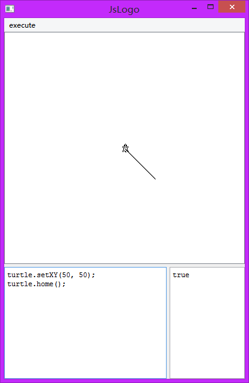
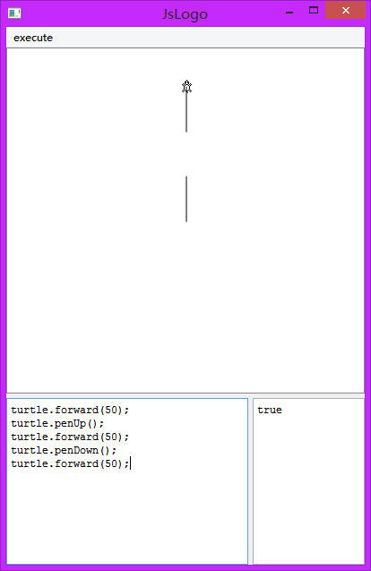
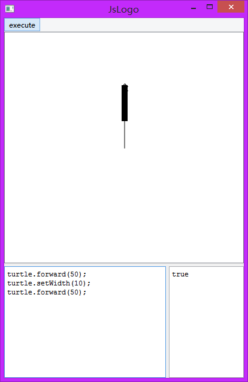

# JsLogo

<sup>(A project using JavaScript does Logo language's do)</sup>

Using Qt builtin Google V8 JavaScript-Engine as a flexible script using in C++

<sup>(A demo to test the [@RPGV2](https://github.com/Ruilx/RPGV2)'s scenarist executing script)</sup>

## JSLogo's common snapshot


## Installation
This project is based on QtSDK version 5.10, and you can compile the project using any version of Qt5 environment.

To download this project, please using:
```shell
	git clone https://github.com/Ruilx/JsLogo
```
and 'cd' in JsLogo, then:
```shell
	qmake
	make qmake_all
```
and finally 'make'(or with MinGW make 'mingw32-make') the project.
```shell
	make -f Makefile.Release
```

## JsLogo's Functions
Using JavaScript to control a "turtle" to draw shapes, and command like [@Logo-language](https://en.wikipedia.org/wiki/Logo_%28programming_language%29).

The code had already built a JS object "turtle" to do the logo command.

* Turtle movement
	* Go forward (forward, fd)
	* Go backward (backward, bk)
	* Go home (home)
	* Go to any coordinate (setX, setY, setXY)
* Turtle rotation
	* Turn left (left, lt)
	* Turn right (right, rt)
* Turtle drawable
	* Pen down (penDown, pd)
	* Pen up (penUp, pu)
* Turtle penstyle
	* Pen width (setWidth)
	* Pen color (setPenColor, setPC)
	* Background color (setBackground, setBg)
* Turtle visible
	* Show Turtle (showTurtle, st)
	* Hide Turtle (hideTurtle, ht)
* Math Calculating
	* Trigonometric functions / Inverse trigonometric functions
	* Logarithm
	* Randoms
* Other functions

## What the turtle does
Using object "turtle" can send the command to turtle on the screen

* Forward and backward
```javascript
	turtle.forward(100);
	turtle.backward(100);
```

* Turn left and right
```javascript
	turtle.left(90);
	turtle.right(90);
```

* Any coordinate and go home
```javascript
	turtle.setXY(50, 50);
	turtle.home();
```

* Draw and release
```javascript
	turtle.forward(50);
	turtle.penUp();
	turtle.forward(50);
	turtle.penDown();
	turtle.forward(50);
```

* Show and hide
```javascript
	turtle.forward(100);
	turtle.hideTurtle();
	turtle.forward(100);
```

* Pen style
```javascript
	turtle.forward(50);
	turtle.setWidth(10);
	turtle.forward(50);
```

* Initialization
```javascript
	turtle.draw();
```
* Repeated

Because JavaScript has cyclic programming, the REPEAT command will replace by "for" or "while" in JavaScript.
* Complex drawing
```javascript
	for(var i = 0; i < 36; i++){
		for(var j = 0;  j < 4; j++){
			turtle.forward(100);
			turtle.left(90);
		}
		turtle.left(10);
	}
```


## Issues
I am grateful you to setup a issue or make a pull request if you found any issues in the project, and if you appreciate this project, please lightup a star on the right top of the page~

Many Thanks for your star~
